# OWASP ZAP Installation Guide

## Introduction

OWASP ZAP (Zed Attack Proxy) is a free and open-source web application security scanner used to identify vulnerabilities in web applications.

Official Website:
https://www.zaproxy.org/

---

## Step 1: Visit the Official Website

Go to:

https://www.zaproxy.org/


---

## Step 2: Open the Download Page

Click **Download** or visit:

https://www.zaproxy.org/download/

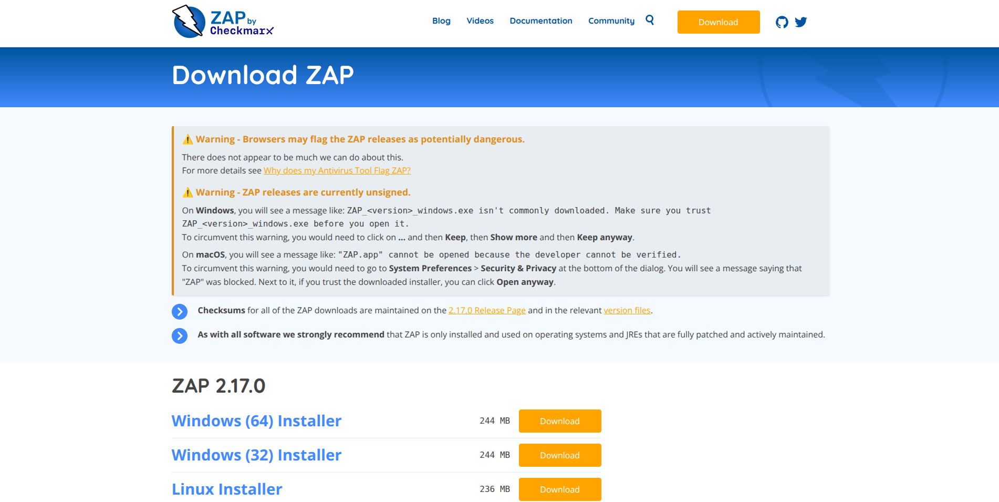


---

## Step 3: Download Linux Installer

Select the Linux Installer (.sh).

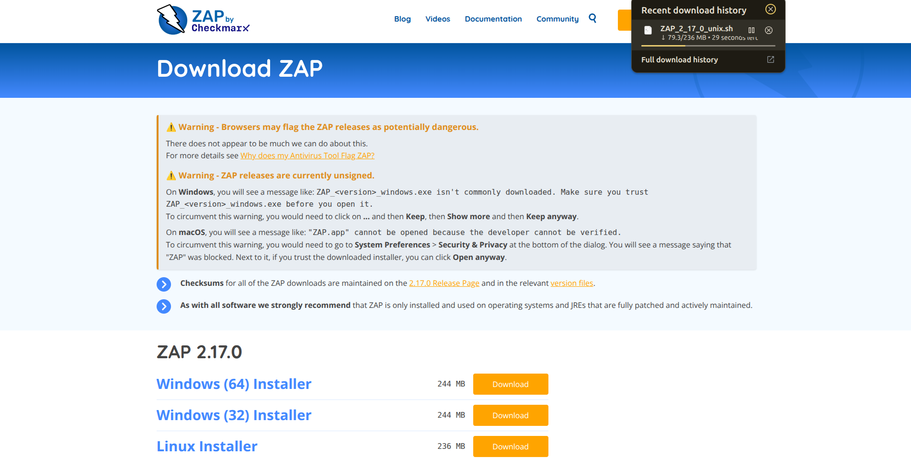

## Step 4: Open Terminal

Navigate to the Downloads folder.

```bash
cd ~/Downloads
```

## Step 5: Make Installer Executable

```bash
chmod +x ZAP_*.sh
```

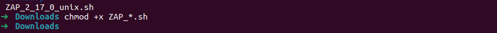

## Step 6: Run the Installer(In root)

```bash
./ZAP_*.sh
```

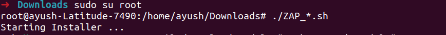

## Step 7: Installation Wizard

Follow the installation wizard.

- Accept the license.
- Choose installation location.
- Continue until installation finishes.

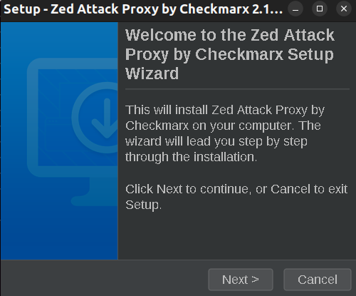

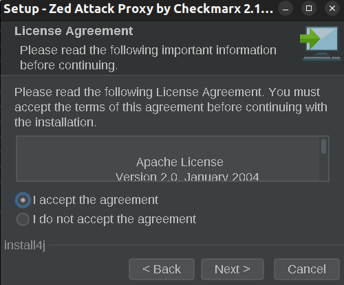

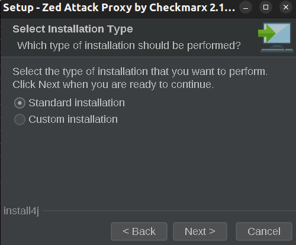

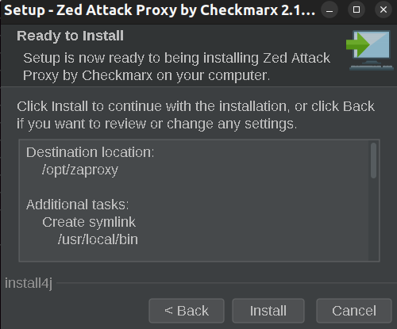

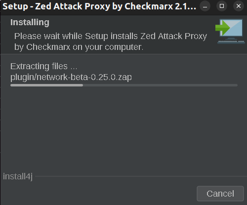

## Step 8: Launch ZAP

Start OWASP ZAP from the Applications menu or terminal.

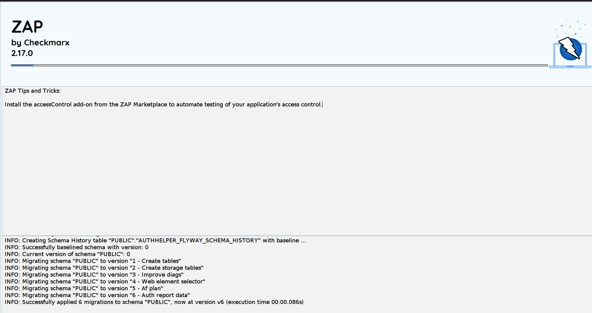

---

## Step 9: Welcome Screen

When ZAP launches successfully, you should see the welcome screen.

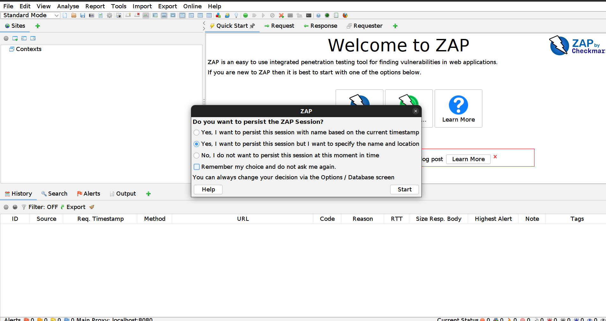

---

## Conclusion

OWASP ZAP has been successfully installed and is now ready for web application security testing.